<<<<<<< HEAD
# **题目： 基于MongoDB集群和SpringBoot的物流订单系统**

## 1.0版本

技术栈：Springboot + MongoDB 的CRUD，layui前端框架

## 2.0版本

技术栈：Springboot + Mybatis，Thymeleaf前端框架，拦截器，kaptcha验证码。
=======


# **题目： 基于MongoDB集群和SpringBoot的物流订单系统**

# 1 实验需求和分析

## MongoDB

MongoDB（来自于英文单词“Humongous”，中文含义为“庞大”）是可以应用于各种规模的企业、各个行业以及各类应用程序的开源数据库。是我所在的实验室中首选的数据库。


图1.1 MongoDB图标

MongoDB其本身是10gen公司开发的一款以高性能和可扩展性为特征的开源软件，它是NoSQL中面向文档的数据库。其介于关系数据库和非关系数据库之间，也是非关系数据库当中功能最丰富，最像关系数据库的。其支持的数据结构非常松散，是类似JSON的BSON格式，因此可以存储比较复杂的数据类型。

MongoDB最大的特点是他的查询语言非常强大，其语法类似于面向对象的查询语言，几乎可以实现类似关系数据库单的绝大部分功能，而且还支持对数据库建立索引。

### 1.1.1 MongoDB的优点

作为一个NoSQL的经典的数据库，其本身具有很多优点：

**1.无表结构:**

>   毫无疑问，MongoDB的最大特点就是无表结构（类似于字典结构）。

>   例如：{“Welcome”:Beijing},{“age”:25}

**2.容易扩展：**

>   MongoDB在最初的设计的时候就考虑到了扩展的问题。它所采用的面向文档的数据模型使其可以自动在多台服务器之间分散数据。这样就可以不用考虑如何扩展，让开发者更加专注于编写应用，适应了当前数据量的飞增。

**3.丰富的功能：**

>   MongoDB有一些真正独特的、好用的功能，而其他数据库不具备或不完全具备：

1.  索引：快速查询；

2.  存储JavaScript：直接存取JavaScript的函数和值；

3.  聚合：支持MapReduce等聚合工具；

4.  固定集合：集合大小有上限；

5.  文件存储：支持用一种容易使用的协议存储大型文件和元数据。

**4.性能卓越：**

>   性能卓越是MongoDB的主要目标，体现在很多设计上：使用MongoDB传输协议作为与服务器的主要交互方式；对文档动态填充，预分配数据文件，用空间换性能的稳定；动态查询优化会“记住”执行查询最高效的方式等。

**5.简便的管理：**

>   MongoDB尽量让服务器自动配置来简化数据库管理。除了启动数据库服务器之外，基本没有什么必要的管理操作。如果主服务器挂掉，MongoDB会自动切换到备份服务器上。总之尽可能让服务器自动配置。

### 1.1.2 MongoDB的不足

其目前还不支持JOIN查询和事务处理。虽然这个是可以规避的。同时还需要注意的是，使用MongoDB创建和更新数据的时候，数据不会实时写入到硬盘里的。所以有可能会有数据丢失的情况。而且本身在保存数据的时候需要预留很大的空间，对硬盘的空间需求较高。

## SpringBoot

，由于Spring的发展、微服务的发展使得SpringBoot越来越流行，已经成为JavaWeb开发的主流框架。SpringBoot是由Pivotal团队提供的全新框架，其设计目的是用来简化新Spring应用的初始搭建以及开发过程。该框架使用了特定的方式来进行配置，从而使开发人员不再需要定义样板化的配置。通过这种方式，SpringBoot在蓬勃发展的快速应用开发领域(rapid
application
development)成为领导者。简而言之，SpringBoot是当前web开发主流，其简化了Spring的配置让开发者能够更容易上手Web项目的开发。且MongdoDB能够快速与SpringBoot整合，在项目中能够快速便捷操作MongoDB；

## 案例分析

我们都知道MongoDB是一款非常出色的非关系型文档数据库，你肯定会想问MongoDB这么强，我们该怎么用或者有啥运用场景呢？MongoDB的应用场景非常多，无论是数据存储还是日志存储越来越多的公司在使用MongoDB，而我们今天也在SpringBoot基础上使用MongoDB实现一个简易版本的物流订单管理系统。在使用前，你自己的电脑上要有IDEA编译器来创建项目，还要拥有MongoDB数据库和Compass(MongoDB可视化数据库管理工具

我想，大部分人都应该有着购物的经历，当商品下单时就会出现一个物流单号，接下来几天内的物流信息会根据这个单号更新。然后接下来的几天可能会到达不同地点，进行更新，你可能会好奇这样一个功能是如何实现，本案例就通过SpringBoot+MongoDB实现一个简易版本的物流订单系统。

## 核心思路

一个订单数据是如何产生和更新的呢？首先一个订单数据由下单时产生，然后该订单经历各个物流点更新物流信息和订单状态，最后在用户取件之后订单状态更新后数据基本就不再更新了。

下单模块：我想大部分人看过寄快递下单流程或者自己下过单，核心就是一个表单页面填写寄件人姓名、地址、手机等信息和收件人姓名、地址、手机等信息。所以在这里具体实现也是填写寄件人和收件人信息储存。

物流模块
：一个订单下单后可能经历若干物流地点，最终才能到达目的地被签收。而就各个物流点来看，各个物流点的管理人员对该物流订单添加一些物流信息，例如到达地址、订单目前状态、联系方式等等。而本案例在添加物流信息的实现上也通过一个表单添加该订单的物流信息，通过物流订单的id进行联立。如果使用关系型数据库，就单订单物流信息存储可能至少需要使用两张表来实现，一张订单(order)信息表存储订单一些固定栏位信息，一张物流(Logistics)信息表储存动态的物流变化，通过订单id实现两张表的关联。


图1.2 数据库E-R图

物流表中的order_id外键引用order表中的id字段进行关联。在查询订单数据的时候需要关联查询。物流订单系统确实可以使用关系数据库去实现，但是数据量过大可能会有性能瓶颈需要优化，如果采用MongoDB不仅可以提高效率，还可以使得流程变得更加简单。

订单的特点是随着递送过程，订单数据需要随时更新路径。数据结构上需要可以灵活应对，这点非常符合MongoDB的document文档模型，并且MongoDB支持GIS功能，非常适用于MongoDB来支撑物流业务(这里简易版本就不使用该功能了)。而物流行业里订单比较独立，跨订单的操作很少，创建、更新(追加)的操作会较多，物流业务模型上与MongoDB非常的匹配。

# 2 MongoDB分布式数据库搭建

## 2.1 环境搭建

本次实验中使用的操作系统是macOS Catalina 10.15.7，使用多个终端模拟分布式集群。

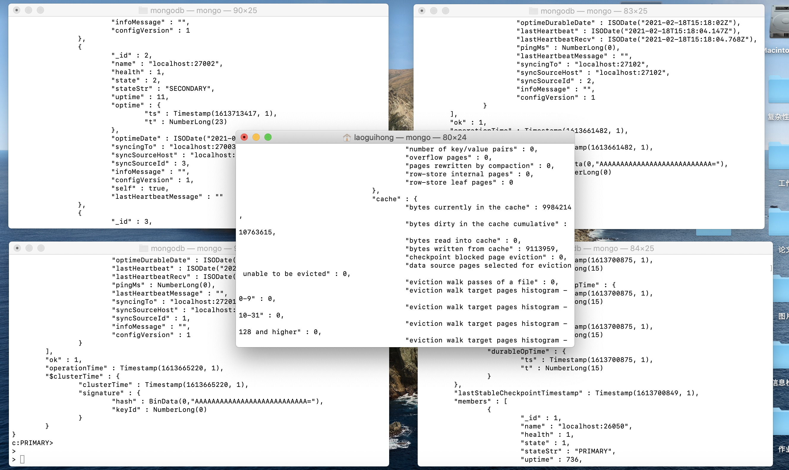

图2.1 使用五个终端模拟分布式集群。左上角为Replica Set a，右上角为Replica Set
b，左下角为Replica Set c，右下角为Config Server，中间为Query Router。

## 2.2 安装数据库

### 2.2.1 MongoDB下载与安装

我们使用 curl 命令来下载安装：

\# 进入 /usr/local

cd /usr/local

\# 下载

sudo curl -O https://fastdl.mongodb.org/osx/mongodb-osx-ssl-x86_64-4.0.9.tgz

\# 解压

sudo tar -zxvf mongodb-osx-ssl-x86_64-4.0.9.tgz

\# 重命名为 mongodb 目录

sudo mv mongodb-osx-x86_64-4.0.9/ mongodb

安装完成后，我们可以把 MongoDB 的二进制命令文件目录（安装目录/bin）添加到 PATH
路径中：

export PATH=/usr/local/mongodb/bin:\$PATH

## 2.3 配置Replica Sets + Sharding

MongoDB采用了“Replica Sets+Sharding”的解决方案。

①**Shard**：使用Replica
Sets（复制集），确保每个数据节点都有备份、自动容错转移和自动恢复的能力；

②**Config**：使用3个配置服务器，确保元数据完整性。

③**Route**：使用3个路由进程，实现负载平衡，提高客户端接入性能。

分别为Replica Set1，Replica Set2，配置服务器，路由进程开启端口：

在本次实验中，我们将会在本机上部署一个完整的生产级别的 MongoDB Shard
集群。集群由3个Shard负责存储数据，其中每个 Shard 都是包含三个结点的 Replica
Set。除此之外，集群还包括3个mongos 和3个Config
Server。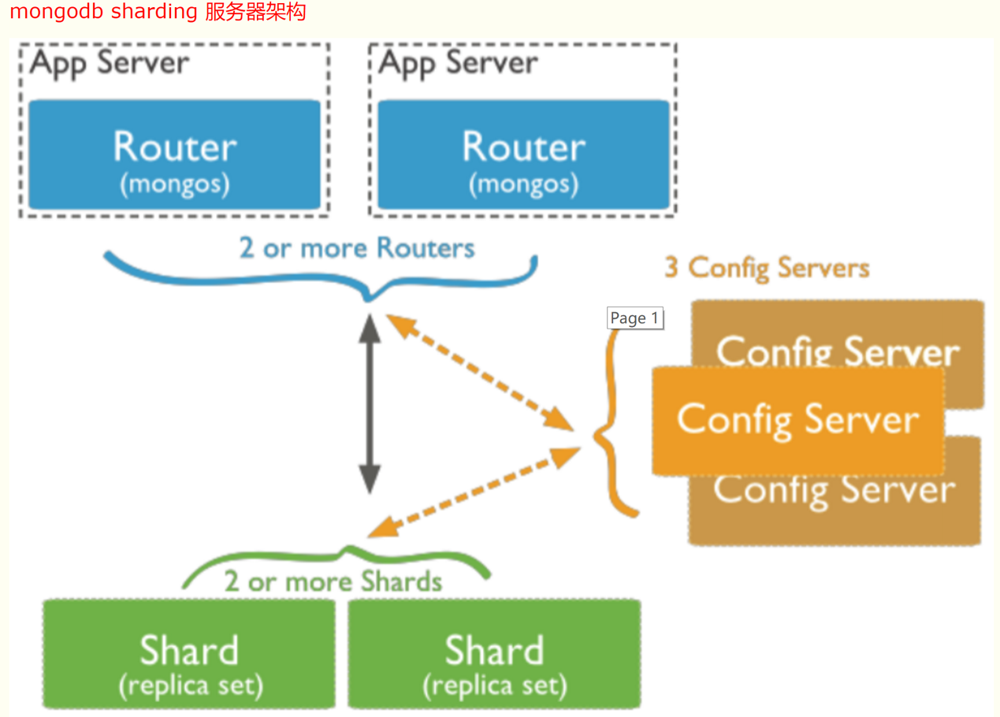

图2.2 Mongo Shard的服务器架构

首先我们分别启动集群的各个成员，分别是 Shard、Config Server 和 Query
Router。其中前两种成员均为 mongod，而 Query Router 则是 mongos。

### 2.3.1配置Replica Sets 

我们先从部署一个三节点的 Replica Set
开始。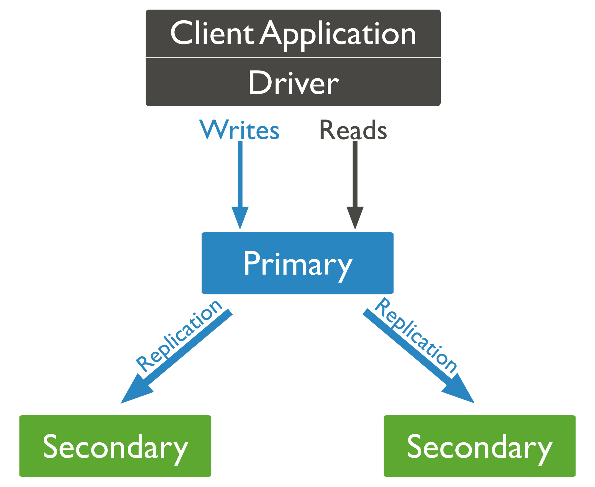

图2.3 Replica Set分布式的基本性质

首先，我们要为每个 mongod 实例创建它自己的 dbpath：

`mkdir a{1,2,3}`

然后，我们便可以开始启动这三个 mongod 实例了：

```
mongod --shardsvr --replSet a --dbpath a1 --logpath log.a1 --port 27001 --fork

mongod --shardsvr --replSet a --dbpath a2 --logpath log.a2 --port 27002 --fork

mongod --shardsvr --replSet a --dbpath a3 --logpath log.a3 --port 27003 –fork
```

注意，这里我是为了在同一台机器上运行三个 mongod
实例，所以需要为它们分别指定不同的端口。如果是真实的分布式 Replica
Set，在每台机器上使用默认的 27017 端口是完全可行的。除此之外，我使用 --replSet
参数指定了 mongod 实例所属 Replica Set
的名字。这个名字是可以随意起的，但必须确保属于同一个 Replica Set 的 mongod
实例设置了相同的 --replSet，否则可能会产生一些不可预期的后果。

再使用 mongo 连接至任意一个 mongod 实例，启动 Replica Set：

```
var conf = {  
\_id : "a",  
members : [  
{ \_id : "a1", host : "localhost:27001" },  
{ \_id : "a2", host : "localhost:27002" },  
{ \_id : "a3", host : "localhost:27003" }  
]  
}  
rs.initiate(conf)
```

在 conf 中，我们将 \_id 设置为 Replica Set 的名称，并在 members 中设置了 Replica
Set 所有成员的信息，其中包括成员的名称 \_id 以及成员的主机名
host。重复上述操作即可启动其余三个 Replica Set。

4 个 Replica Set 的信息分别如下：

```
{

\_id : "a",

members : [

{ \_id : "a1", host : "localhost:27001" },

{ \_id : "a2", host : "localhost:27002" },

{ \_id : "a3", host : "localhost:27003" }

]

}

{

\_id : "b",

members : [

{ \_id : "b1", host : "localhost:27101" },

{ \_id : "b2", host : "localhost:27102" },

{ \_id : "b3", host : "localhost:27103" }

]

}

{

\_id : "c",

members : [

{ \_id : "c1", host : "localhost:27201" },

{ \_id : "c2", host : "localhost:27202" },

{ \_id : "c3", host : "localhost:27203" }

]

}
```


### 2.3.2配置Config Server

接下来开始启动 Config Server：

```
mkdir cfg{1,2,3}  
mongod --configsvr –-replSetcfgReplSet --dbpath cfg1 --logpath log.cfg1 --port
26050 --fork  
mongod --configsvr –-replSetcfgReplSet --dbpath cfg2 --logpath log.cfg2 --port
26051 --fork  
mongod --configsvr –-replSetcfgReplSet --dbpath cfg3 --logpath log.cfg3 --port
26052 --fork
```

注意：–replSet cfgReplSet这个参数是mongodb3.4之后的要求，因为mongodb3.4之后，要求configserver也做成副本集，配置副本集的方法同上。如果config server不配置replicaset，还是采用mongodb 3.2的mirror模式，会在配置路由的时候报错。

### 2.3.3配置Query Router

```
mongos --configdb cfgReplSet/localhost:26050,localhost:26051,localhost:26052
\--logpath log.mongos1 --port 26060 --fork

mongos --configdb cfgReplSet/llocalhost:26050,localhost:26051,localhost:26052
\--logpath log.mongos2 --port 26061 --fork

mongos --configdb lcfgReplSet/localhost:26050,localhost:26051,localhost:26052
\--logpath log.mongos3 --port 26062 –fork
```

如此一来，集群的各个成员都启动完毕了，可以开始配置集群了。

### 2.3.4配置Shard Cluster

实际上，在启动 mongos 时，我们已经指定了集群所使用的 Config Server
的地址。接下来就是为集群指定每个 Shard 的地址了。打开 mongo 连接至任意一个
mongos，并执行如下指令：

```
sh.addShard("a/localhost:27001")

sh.addShard("b/localhost:27101")

sh.addShard("c/localhost:27201")
```

注意到，我们添加 Shard 时，输入了 Replica Set
的名称以及其中一个成员的地址。该成员并不一定得是 Primary，只要它是该 Replica Set
的成员，mongos 就能自动发现 Replica Set 的其他所有成员。在添加了 4 个 Shard
以后，整个 Shard 集群便配置完毕，可以开始使用了。

检查，显示shard状态：

****

图2.4 显示shard状态

检查，显示shard配置：


图2.5 显示shard配置

那么分布式数据库就搭成了，我接下来要做一些测试，证明Sharding运行的正常性以及验证分布式的效果。

# MongoDB分布式数据库测试

## 3.1分片测试

我们新建一个数据库：

```
sh.enableSharding("oracleblog");
```

建立collection，和相关字段：

```
sh.shardCollection("oracleblog.testtab",{age: 1, name: 1})
```

需要重新设置chunksize为1M，从而实现分片存储：

```
use config
db.settings.save( { \_id:"chunksize", value: 1 } )
```

首先我想先验证一下是否真的是分布式的，于是向我之前创建的test数据库中的users集合中插入200000条数据，（其中插入的数据是我照着书上的例子写的，没啥含义），命令如下：

```
**for** (i=1;i\<=200000;i++) db.testtab.**insert**({name: "user"+i, age:(i%150)})
```

经过我的测试，这200000条数据大约30秒存完，我感觉这个速度虽然比不上关系型数据库，虽然本来Mongo就在速度上比不过关系型的数据库（如我常用的MySQL）。同时我发现这个速度和非分布式的Mongo速度也有一定的距离，是要慢上不少的，但是这个速度还是可以的。

之后查看数据库状态，图3.1和3.2中发现shard1中存了60801条数据，shard2中存了72972条数据，shard2中存了66227条数据，证明了是分布式存储。


图3.1 三个不同shard所存的数据

## 3.2容错测试

**1.断开一个节点**

这里我通过断开其中的一个节点来测试其容错性。

通过图3.2可以看到，我已经将复制集a的27002端口关闭了。注意，在这里不能关闭a的27001端口，因为在前面mongos添加shard的时候，将27001作为连接的接口。错误关闭27001端口会造成数据库操作时发生错误。

通过图3.3可以看到分布式数据库中无法连接到27002端口。（在开始的时候，错误关闭了27001端口，后修正。）

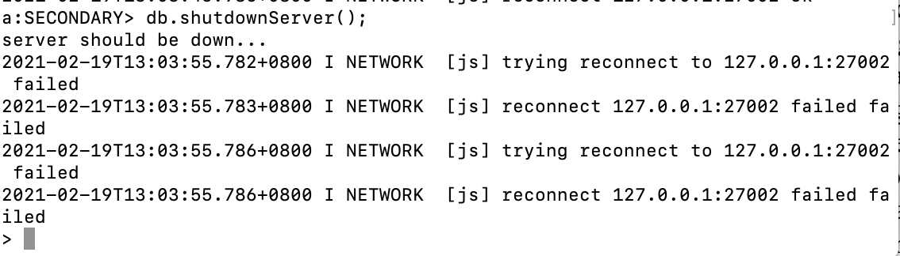

图3.2 关闭复制集a的27002端口

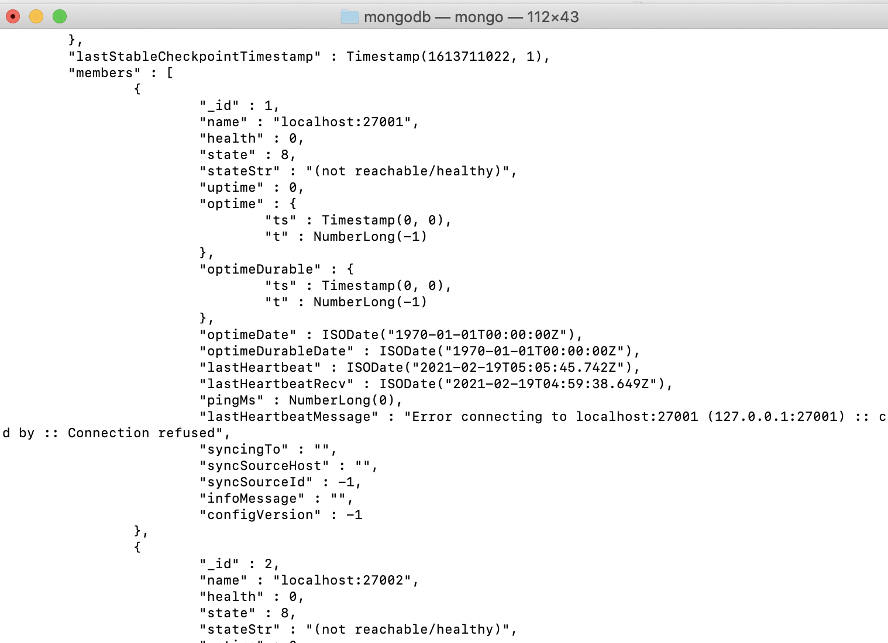

图3.3 端口27002无法被访问

**2.新插入数据**

那么在一个节点无法连接的情况下，为了测试分布式数据库还能用，接着我又重新向分布式数据库中存入190000个点（因为接近200000个点，可以用来测试速度）。发现存储速度略有降低。但是没有数据的损失，如图3.4。这里在计算数据数量的时候出现了不准确的现象。经过查询，官方文档解释了这种现象的原因：

-   操作的是分片的集合。

-   shard 分片正在做块迁移，导致有重复数据出现。

-   存在孤立文档（因为不正常关机、块迁移失败等原因导致）。

插入数据：

for (i=1;i\<=190000;i++) db.testtab.insert({name: "user"+i, age: (i%150)})


图3.4 新增数据后shard的数据分布

经过测试我们发现数据库依然workspace，其中复制集a存了136018个数据，复制集b存了128755个数据，复制集c存了146774个数据，没有数据丢失，因为我们每个节点处都有数据的完整备份，断掉一个节点后不会影响该分布式数据库的工作。

## 重连测试

那么接下来要测试将断开的节点重新连到数据库上，看是否会有影响。


图3.5 将端口27002重新连上

然后插入新的数据

for (i=1;i\<=9999;i++) db.testtab.insert({name: "user"+i, age: (i%150)})

发现最终得到的数据结果正常了，三次插入数据之和正好是如图3.6所示中的count，不知道是巧合，还是查询的时间不同导致的计算结果不一致。


图3.5 重连之后shard的数据分布

# 案例数据可视化和实现准备

建立好分片集群，就可以一步一步开始动手实现本案例，本案例要实现的就是订单创建、订单信息更新、查询、删除的一个小型完整的物流订单管理系统。而在具体实现上按照以下步骤：

预备工作:创建数据库和项目

订单添加

订单更新

订单查询

订单删除

整个案例实现火热运行的环境如下：

操作系统：macOS Catalina

JDK版本：JDK8

编译器：IDEA

MongoDB版本：4.4.0

MongoDB可视化管理工具：Compass

## 4.1 安装compass并连接数据库

打开Compass数据库管理工具，连接本地MongoDB数据库之后，创建名为System的数据库，在System数据库中创建名为order的集合：


图4.1 compass连接上分片集群


图4.2 创建订单系统

## 4.2 创建SpringBoot项目

打开IDEA创建项目，选择创建SpringBoot项目。然后在选择Gruop和Aritifact的时候分别填写com和mongodemo，Java
Version选择8版本。在勾选模块时候，这里勾选Spring
web、MongoDB依赖模块，选择合适位置创建项目，项目就可以成功创建


图4.3 订单系统文件结构

创建项目之后，需要做一些前置工作预备。

## 4.3创建SpringBoot项目

创建完项目，我们需要做一些预备工作用来完成缓存。我们首先要在项目中的application.properties中添加配置连接到数据库，配置规则为：spring.data.mongodb.uri=mongodb://地址:端口/数据库名，本案例使用本地的MongoDB数据库，默认端口为27017，而使用的MongoDB具体数据库名称为test，那么就可以按照以下进行配置：

spring.data.mongodb.uri=mongodb://localhost:26060/system

这样在项目中就可以连接到本地的MongoDB的test数据库并访问。其次在项目中com.mongodb目录下分别创建controller，service，pojo文件夹，在controller文件夹下创建orderController类，为负责url和逻辑的控制器.
orderController创建完毕后，在service
文件夹下创建orderService.java类。service创建完成，我们需要在pojo中创建logistics类和order类，分别表示具体物流信息和订单信息。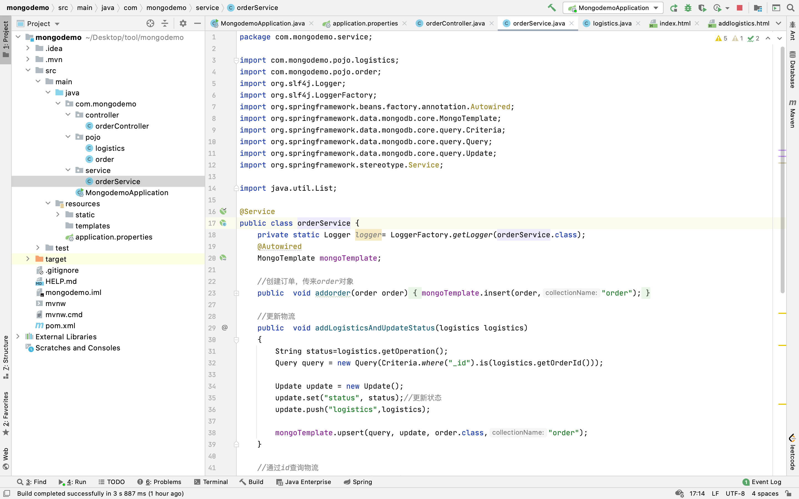

图4.4 加入物流系统后端结构

## 4.4创建html相关文件

在static文件夹下创建index.html,addlogistics.html,addorder.html.ordermanage.html.

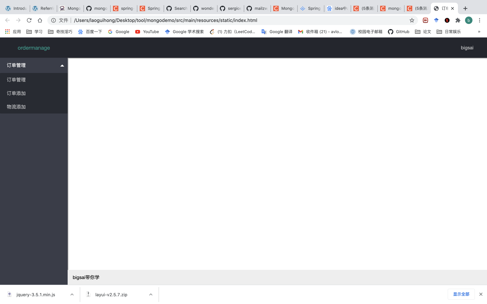

图4.5 后台管理初步界面

左侧三个菜单分别对应创建的ordermanage.html，addorder.html，addlogistics.html三个页面。至此预备工作已经完成了，下面只需要完成具体的操作。

# 物流订单系统的简单实现

## 订单添加

### 后端部分

首先，在orderService编写addorder函数，用来向MongoDB中添加订单。具体代码如下：

```
public void addorder(order order)  {   mongoTemplate.insert(order,"order");  } 
```

上面的代码中插入的语句为
mongoTemplate.insert(order,"order")，第一个参数为插入的文档记录，第二个参数"order"为连接的MongoDB对应数据库下的集合(Collections)。

在orderController中编写addorder()接口，用来处理前端的请求添加订单。具体代码为：

```
@Autowired  orderService orderService;  @PostMapping("addorder")  public String addorder(order order)  {  order.setStatus("发货中");  order.setOrderTime(new Date());  order.setShipTime(new Date());  orderService.addorder(order);  return "添加成功";  }
```


### 前端部分


图5.2 增加订单管理的界面

### 测试添加订单

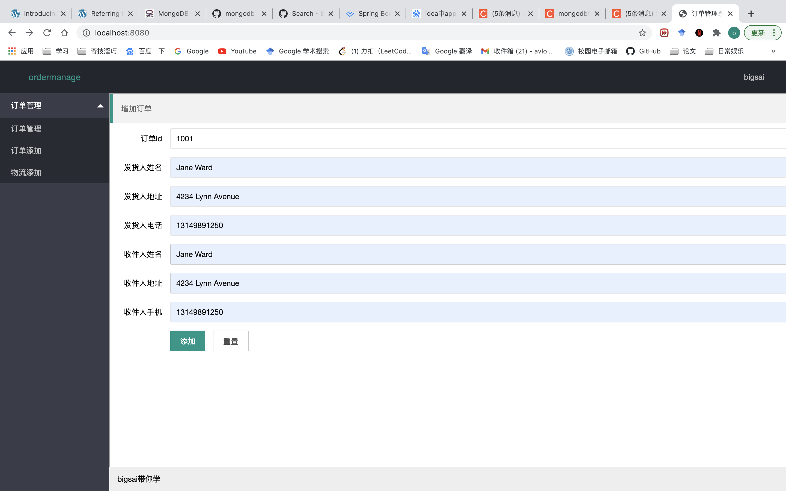

图5.3 添加用户

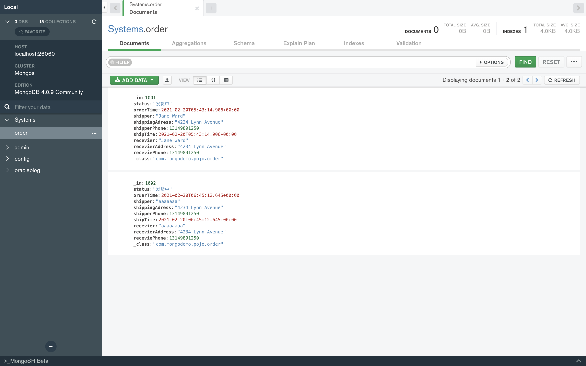

图5.4 Compass中的数据显示

## 订单更新

创建完订单之后，无数配送公司和人员便开始配送物流，而我们在查询的时候，物流状态信息也能够时不时的刷新，具体物流信息也能得到追加。

### 后端部分

在后端的处理上，我们先写service，再写controller，在orderService中编写addLogisticsAndUpdateStatus()函数，主要实现更新订单的状态和订单的物流情况。具体代码为：

```
 //更新物流  public void addLogisticsAndUpdateStatus(logistics logistics)  {  String status=logistics.getOperation();  Query query = new Query(Criteria.where("_id").is(logistics.getOrderId()));  Update update = new Update();  update.set("status", status);//更新状态  update.push("logistics",logistics);  mongoTemplate.upsert(query, update, order.class);  }
```

编写完orderService，在orderController中编写一个名为updateorder的接口，用来处理更新的请求和参数并执行更新的操作。同样接口类型为post类型，接收部分参数然后将物流操作时间设置为当前时间，调用orderService的addLogisticsAndUpdateStatus()方法执行更新的操作。这样后端部分就完成了。

### 前端部分

执行程序访问localhost:8080,点击添加物流，根据1001的订单号添加物流信息。

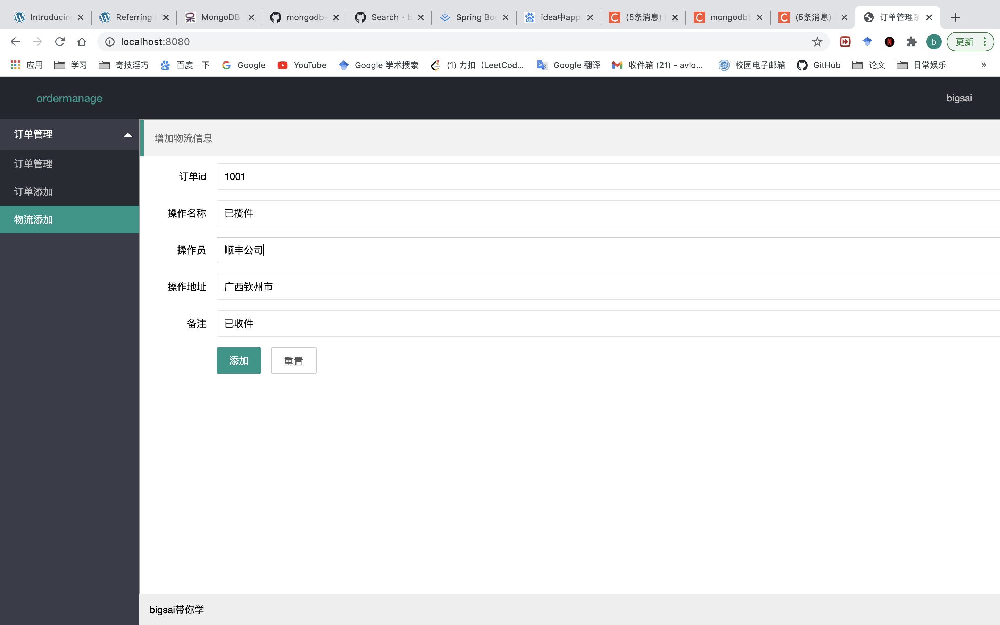

图5.5 添加物流界面

添加之后查看MongoDB中订单状态得到更新且物流数据得到更新


图5.6 物流状态出现更新

## 订单查询

### 后端部分

订单的添加和修改都完成了，非常重要的查询当然不能少，不仅不能少，还要特色的展示，这里查询通过一个订单号查询对应订单的状态和物流。首先在orderservice中编写getOrderById()函数，用来根据订单id查询该条订单记录。具体代码为：

```
//通过id查询物流  public order getOrderById(int id)  {  Query query = new Query(Criteria.where("_id").is(id));  order order=mongoTemplate.findOne(query, order.class);  return order;  }  
```

写完service然后在orderController中编写getorderbyid接口用来处理用户请求和参数并调用orderService的getOrderById()方法给前端返回该order对象序列化成的json字符串。

### 前端部分

订单的添加和修改都完成了，非常重要的查询当然不能少，不仅不能少，还要特色的展示，这里查询通过一个订单号查询对应订单的状态和物流。后端设计完成之后，需要前端来实现，在这里使用Ajax来实现交互，前端页面点击按钮JavaScript携带参数发送请求，后端查询MongoDB后返回结果给前端渲染，而在渲染方面为了更像物流订单系统，我们使用layui的时间轴**组件，将各个物流订单数据直观性展示。


图5.7 订单状态查询

## 订单删除

作为管理人员，可能偶尔会遇到特殊情况需要删除订单，而这种操作需求也是很有必要的，在这里实现根据id删除订单。我们在删除订单时候，一般先查询订单的一些数据和结果，然后根据查询的id删除对应的记录。

### 后端部分

首先在orderService中编写deleteOrderById()函数，用来根据id删除,编写getAllorder()函数，用来查询所有订单。写完service，接着在orderController中编写deletebyid接口和getallorder接口，分别用来接收处理删除订单的请求和获取所有订单的请求

```
 @GetMapping("deletebyid")  public String deleteById(int id)  {  orderService.deleteOrderById(id);  return "成功";  }  @GetMapping("getallorders")  public Map\<String,Object\> getAllOrder()  {  Map\<String,Object\>map=new HashMap\<\>();  List\<order\> list=orderService.getAllorder();  map.put("code","0");  map.put("count",list.size());  map.put("data",list);  return map;  } 
```

其中，getallorder接口返回一个Map\<String,Object\>类型的数据格式，这是因为layui表格需要特定的json格式所以我们将数据存到Map中返回。启动访问localhost:8080/getallorders你会看到以下格式：


图5.8 接口状态

### 前端部分

启动程序，访问localhost:8080，点击订单管理，看到查询的物流订单咱们删除id为1001:


图5.9 删除数据

再查看页面和MongoDB数据库，你会发现id为1001的记录被成功删除：

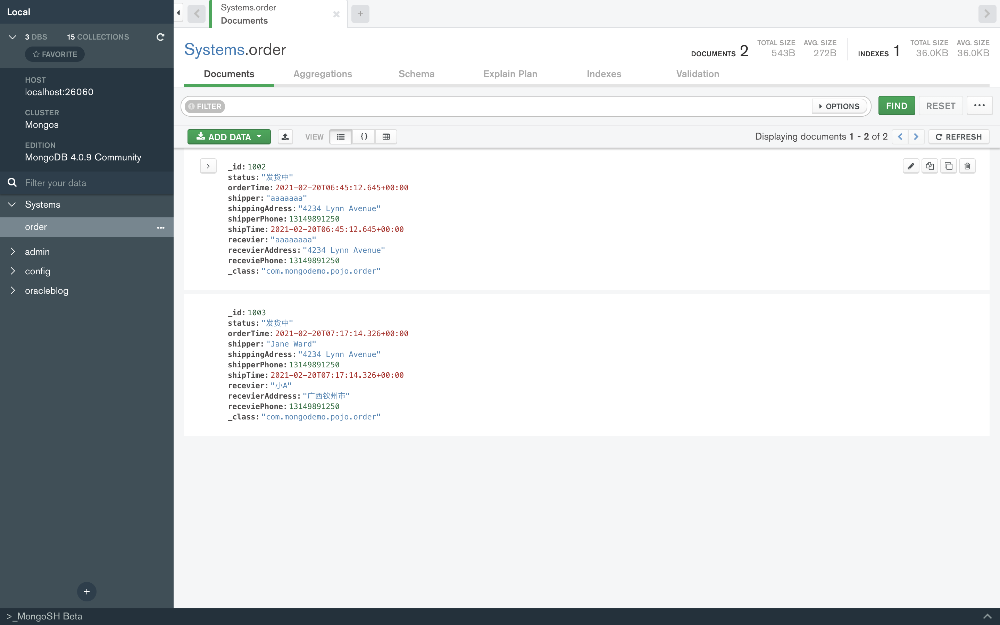

图5.10 查看数据是否成功删除

到此，MongoDB的实验物流订单系统就完成了。回顾本次实验，首先是从宏观介绍了MongoDB这个非关系型数据库特点以及场景，从场景中选取一个比较适合的案例作为本课程案例—实现一个物流订单系统，紧接着带你简单分析物流订单案例逻辑以及在关系数据库和MongoDB中的不同处理方式，最后创建Springboot整合MongoDB的项目实现一个简易版本的物流订单系统。

# 个人总结

本次大作业确实有些难度，因为光靠我们课堂上讲的知识是无法搭建一个分布式数据库的，而且因为在假期做实验的原因，实验器材不够齐全，导致了本来应该做不同机器的集群，最终只能在自己的一台机器上面实现数据库集群。

在搭建完数据库之后，建立SpringBoot对于我来说也是一个十分艰难的过程。在通过查阅了很多资料之后，勉强建立了一个简易的物流订单系统。在这个过程中我也学习到了很多关于Java面向对象项目的相关知识。通过这个项目的练习，提高了对于数据库的熟悉程度，以及阅读相关代码的能力。

我平日里常接触的数据库有两个，一个是MySQL，另个就是MongoDB，这两个数据库也都是我们实验室首选的数据库，但是经过我调查发现MySQL可能没有属于自己的分布式数据库，所以我把本次课题的目标定为了MongoDB。

当然在搭建过程中遇到了不少问题，包括了安装出错的问题、时钟不匹配的问题、不分片存储的问题，多亏了实验室中的师兄细心教导我和我的队友才完成的实验。

最后感谢徐喜荣老师这一学期的教导。
>>>>>>> 8fb77ee7d8c8b4349a528eef5f6ca5550f9d6721
